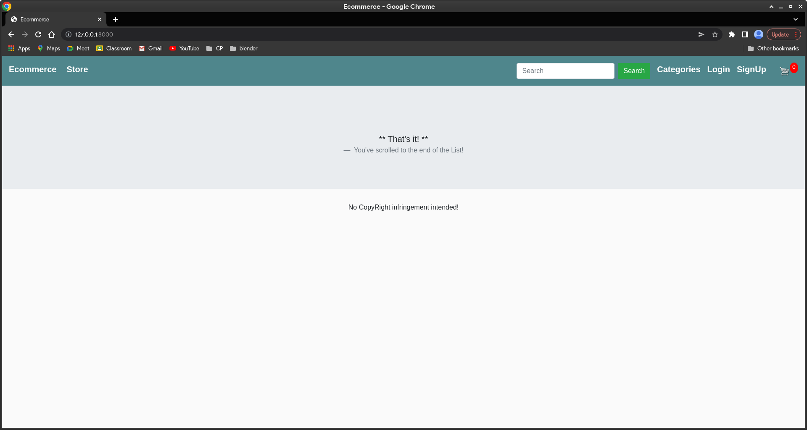
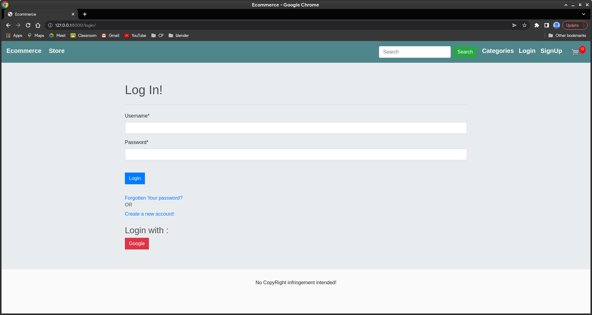
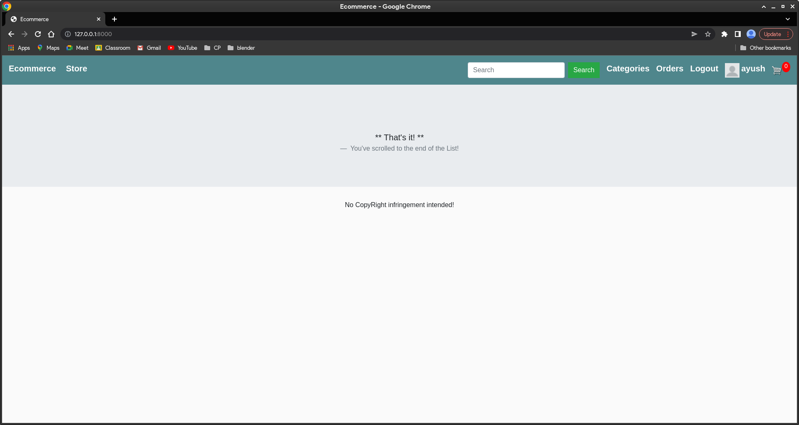
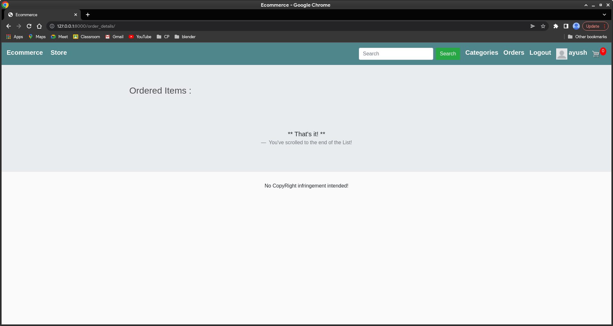
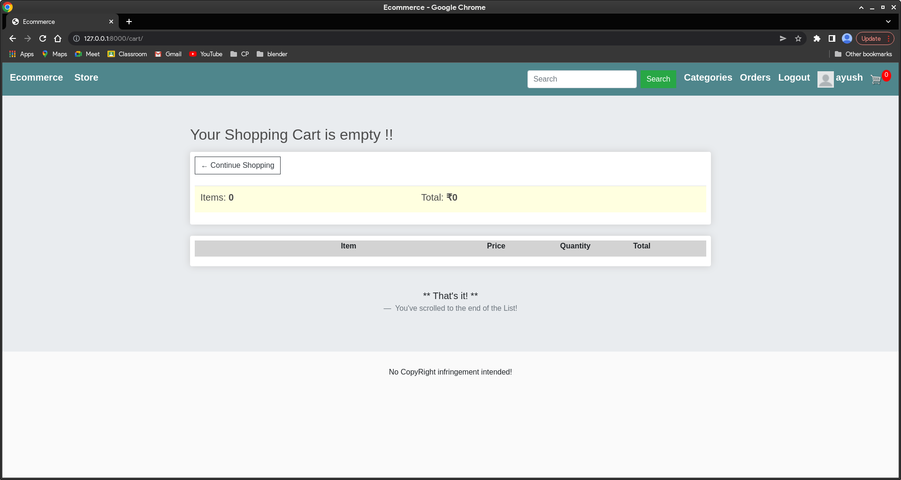

<<<<<<< Updated upstream
# LoginKpil.github.io
=======
# Ecommerce-Website

This is my submission for the Xenonstack task.
## Setup
1. pip install -r requirements.txt
2. cd Qoura-clone
3. python manage.py makemigrations
4. python manage.py migrate
5. python manage.py runserver
6. Access admin panel by creating superuser :->  python manage.py createsuperuser

## Screenshots
#### This is the main screen.

#### This is the login screen.

#### This is the login screen after the user has logged in.

#### This is the orders screen.

#### This is the cart.

>>>>>>> Stashed changes
